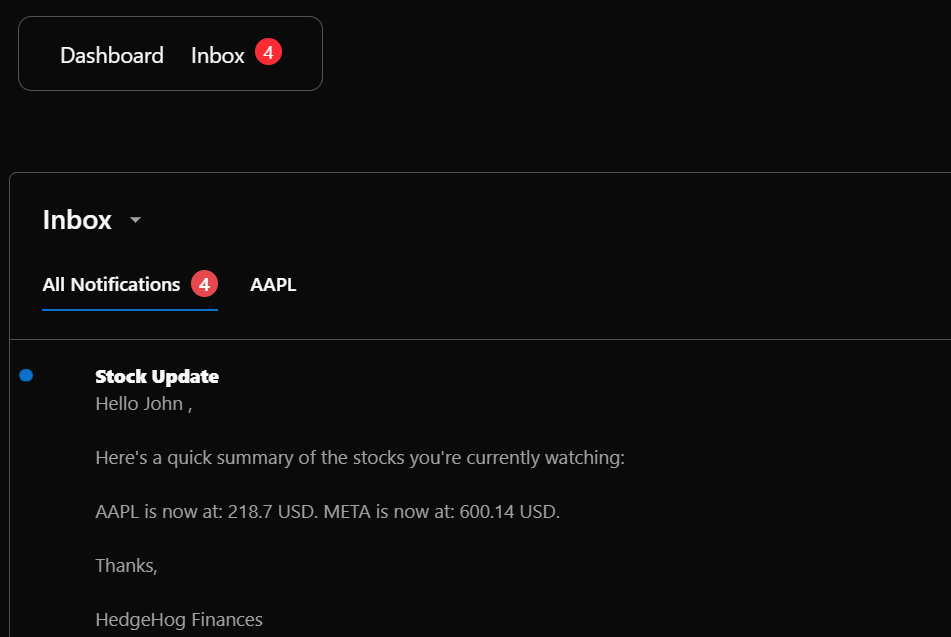

# Hedgehog Finances

## Table of Contents
1. [Project Description](#project-description)
2. [How to Install and Run the Project](#how-to-install-and-run-the-project)
3. [Minimum Version Requirements](#minimum-version-requirements)
4. [How to Use the Project](#how-to-use-the-project)
5. [Deployed Application](#deployed-application)
6. [Credits](#credits)

## Project Description
### Introduction
Hedgehog Finances is a sleek, real-time stock tracking app built using the powerful [Next.js](https://nextjs.org) framework. The project, created as part of a JavaScript boot-camp, showcases the full-stack web development skills acquired during the course.

### Features
Designed for modern investors, Hedgehog Finances empowers users to stay informed about their favorite stocks with real-time notifications and personalized tracking features. 

### Technologies Used
#### Frontend:
- **Frameworks**: Built with [Next.js](https://nextjs.org), a React-based framework tailored for building dynamic and efficient web applications.
- **Language**: Written in TypeScript, ensuring type safety and scalability for the codebase.
- **UI Components**: Utilizes [Radix UI](https://www.radix-ui.com/) components for accessible, high-quality building blocks that enhance user interface development.
- **Styling**: Styled with [TailwindCSS](https://tailwindcss.com/), a highly customizable utility-first CSS framework for consistent and modern design.
- **Font Optimization**: Leverages - [`next/font`](https://nextjs.org/docs/app/building-your-application/optimizing/fonts) to automatically optimize and load [Geist](https://vercel.com/font), a distinctive font family provided by Vercel, ensuring fast and high-quality text rendering.

#### Backend:
- **Database**: [MongoDB](https://www.mongodb.com/) is used to store data in a scalable and flexible format.
- **ORM**: [Prisma ORM](https://www.prisma.io/) enables efficient, type-safe database interaction.
- **Authentication**: [Firebase Authentication](https://firebase.google.com/docs/auth/) handles user sign-ups, logins, and session management securely. for interacting with a database hosted on MongoDB, leveraging Firebase for user authentication.
- **Cron-Job**: We used [cron-job.org](https://cron-job.org/en/) to periodically ping an **api/cron** endpoint that then triggered a user notification cascade.

#### APIs:
- [Twelve Data](https://twelvedata.com/) REST API for access to financial data.
- [Financial Modeling Prep](https://site.financialmodelingprep.com/developer/docs/stable#dividends-company) Dividends Company API.
- [Firebase](https://firebase.google.com/docs/reference) API for user sign-up, login, and session management.
- [novu](https://docs.novu.co/api-reference/overview) API for real-time Inbox and notifications.
- [web-push](https://www.npmjs.com/package/web-push) for push notifications.

### Challenges and Learning
Beyond the initial learning curve of adopting TypeScript and Next.js—both of which were new technologies for our team—we faced a notable challenge in implementing cron jobs for user notifications within Vercel's serverless hosting environment. Traditional cron jobs aren't supported in serverless infrastructure, so we devised an innovative solution: creating an api/cron endpoint that is periodically pinged via [cron-job.org](https://cron-job.org/en/). This triggers a notification cascade managed through [novu](https://novu.co/), enabling reliable, real-time updates for our users.


### Future Features
Unfortunately, the [Twelve Data](https://twelvedata.com/) Trial plan only provides access to US market data. Upcoming updates to Hedgehog Finances will introduce international data coverage. Additionally, users will have the ability to personalize the graphs on their dashboard, including adjusting the displayed time frame.


## How to Install and Run the Project

1. Clone the repository:
```
git clone https://github.com/patrickfoulger1/hedgehog-finances.git
```


2. Navigate into the project directory:
```
cd hedgehog-finances
```


3. Install dependencies:
```
npm i
```


4. Run the project:
```
npm run dev
```

5. Open [http://localhost:3000](http://localhost:3000) in your browser to see the result.

You can start editing the page by modifying `src/app/page.tsx`. The page auto-updates as you edit the file.

## Minimum Version Requirements

| Software                | Version   |
|-------------------------|-----------|
| Next.js	              | ^15.2.0   |
| React                   | ^19.0.0   |
| React-DOM	              | ^19.0.0   |
| TypeScript              | ^5        |
| ts-node                 | ^10.9.2   |
| Node.js	              | ^20       |
| Axios	                  | ^1.8.1    |
| Prisma CLI	          | ^6.4.1    |
| Tailwind CSS            | ^4.0.0    |

## How to Use the Project
Once users have created an account and are signed in, they can take advantage of the following features:

| Feature                | Description                                                                  |
|------------------------|------------------------------------------------------------------------------|
| Browse Companies       |	Search and explore companies of interest using an intuitive search bar.|
| View Stock Performance | Access stock performance data for a company, displayed over the past 25 trading hours. |
| View Dividend Information | Review comprehensive dividend details, including the next payment date and the amount per share. |
| News Feed | Stay updated with a dynamic feed of articles related to the company's performance and value.
| Watchlist Companies | Easily add companies to your Watchlist for quick access and tracking. |
| Dashboard	| View data for all watchlisted companies simultaneously on your personalised Dashboard. |
| Notifications	| Set custom notifications for updates on your watchlisted stock symbols. |
| Inbox	| Access a dedicated Inbox to review all notifications related to your watchlisted stocks. |


### User Guide
 **Navigating the Interface**
   - **Landing Page**: From the landing page, users can sign in or create an account.
   
   
   - **Search**: Once signed in, users can search for a company:
   

   - **Stock Close Graph**: Once a company is selected from the search bar, users are presented with a graph displaying the company's stock close prices over the last 25 trading hours. The graph is interactive, allowing users to hover their cursor over any point to view the precise closing value at a specific time during that period. Alongside the graph, trending information is displayed, indicating whether the stock is trending up or down and by what percentage. For additional clarity, graphs of stocks that are trending down are colored red, while those trending up are colored green.
   

   - **Dividends & News**: On the same page, users can see dividend information for the company, including the next payment date and the amount per share. Below this, a dynamic news feed is displayed, featuring a curated list of articles related to the company and its performance. Each news card is clickable, redirecting the user to the original article for further insights.
   

   - **Dashboard**: Clicking 'Add to Watchlist' beside a company's stock symbol seamlessly adds that company to the user's personalized Dashboard, accessible via the 'Dashboard' link in the top left corner of the page. The Dashboard provides an overview of all watchlisted companies, displaying their stock performance graphs simultaneously for easy comparison and monitoring.
   

   - **Set Alerts**: If a company is added to a user's watchlist, they can click the 'Set Alerts' button located beside the company's stock symbol. This allows the user to customize their notification preferences for that stock. Notifications can be received via In-App Alerts, Email Notifications, and/or Push Notifications. Users can select one or more of these options based on their preferences.
   

   - **Notification Preferences**: Clicking the profile picture, then selecting 'Alerts' from the drop-down menu redirects users to their Notification Preferences page, where they can conveniently view and set which notifications they would like to receive for each company in their watchlist.
   

   - **Inbox**: Selecting 'Inbox' from the top left corner of the page directs users to their inbox, where they can conveniently view all notifications related to their watchlisted stock symbols.
   


## Deployed Application
Check out the live version of the application hosted on Vercel:
[Hedgehog Finances](https://hedgehog-finances-nine.vercel.app/)

The easiest way to deploy *your* Next.js app is to also use the [Vercel Platform](https://vercel.com/new?utm_medium=default-template&filter=next.js&utm_source=create-next-app&utm_campaign=create-next-app-readme) from the creators of Next.js.

### Learn More
To learn more about Next.js, take a look at the following resources:

-   [Next.js Documentation](https://nextjs.org/docs) - learn about Next.js features and API.
-   [Learn Next.js](https://nextjs.org/learn) - an interactive Next.js tutorial.

You can check out [the Next.js GitHub repository](https://github.com/vercel/next.js) - your feedback and contributions are welcome!

## Credits
This portfolio project was created as part of a Digital Skills Boot-camp in Software Engineering provided by [Northcoders](https://northcoders.com/)

---
We hope you find this README helpful!